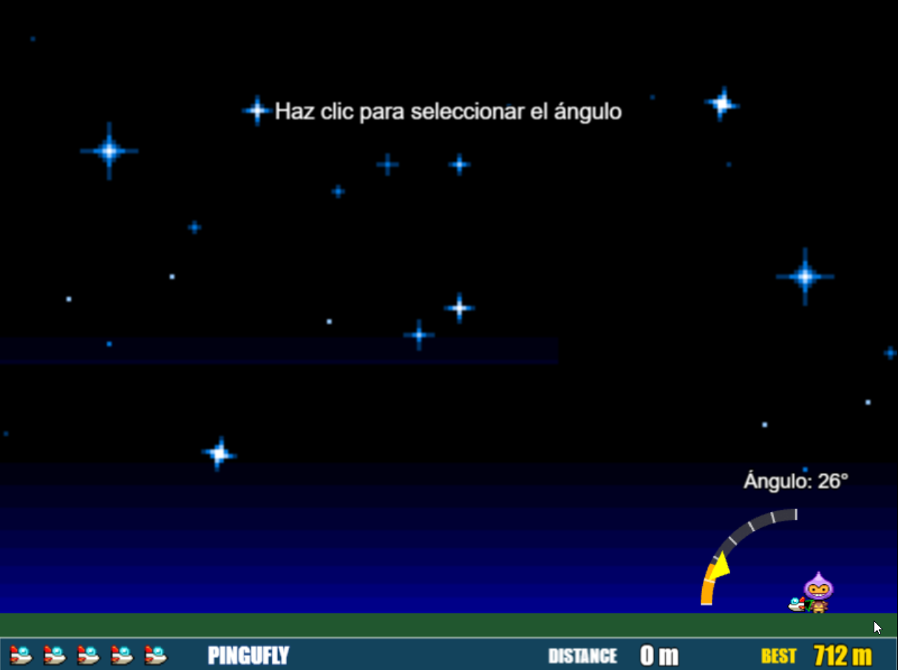

# 🐧 PinguFly


<div align="center">
  
  <p><em>PinguFly en acción: Fase de selección de ángulo con el pingüino listo para ser lanzado</em></p>
</div>

Una reimaginación moderna del clásico juego Yeti Sports Pingu Throw, donde lanzas un pingüino lo más lejos posible a través de un hermoso paisaje invernal y compites por la mejor distancia.

[¡Juega PinguFly Online!](https://pingufly.sergiomarquez.dev/) | [Reportar un bug](https://github.com/sergiomarquezdev/pingufly-2d/issues) | [Sugerir una función](https://github.com/sergiomarquezdev/pingufly-2d/issues)

## 📖 Contenido

- [🐧 PinguFly](#-pingufly)
  - [📖 Contenido](#-contenido)
  - [🎮 Sobre el Proyecto](#-sobre-el-proyecto)
    - [Construido Con](#construido-con)
    - [Características del Juego](#características-del-juego)
  - [✨ Funcionalidades en Detalle](#-funcionalidades-en-detalle)
    - [Física Realista](#física-realista)
    - [Sistema de Lanzamiento en Dos Fases](#sistema-de-lanzamiento-en-dos-fases)
    - [Entorno Invernal Dinámico](#entorno-invernal-dinámico)
    - [Seguimiento de Puntuación y Progreso](#seguimiento-de-puntuación-y-progreso)
    - [Sistema de Audio Avanzado](#sistema-de-audio-avanzado)
    - [Diseño UI Responsivo](#diseño-ui-responsivo)
    - [Gestión de Estados de Juego](#gestión-de-estados-de-juego)
  - [🔧 Arquitectura y Diseño Técnico](#-arquitectura-y-diseño-técnico)
    - [Estructura Modular](#estructura-modular)
    - [Sistema de Componentes](#sistema-de-componentes)
    - [Manejo de Recursos](#manejo-de-recursos)
    - [Flujo de Juego](#flujo-de-juego)
  - [⚙️ Implementación Técnica](#️-implementación-técnica)
    - [Optimizaciones de Rendimiento](#optimizaciones-de-rendimiento)
    - [Arquitectura de Código Modular](#arquitectura-de-código-modular)
    - [Integración de Analytics](#integración-de-analytics)
    - [Adaptaciones para Móviles](#adaptaciones-para-móviles)
  - [🚀 Primeros Pasos](#-primeros-pasos)
    - [Requisitos Previos](#requisitos-previos)
    - [Instalación](#instalación)
    - [Comandos Disponibles](#comandos-disponibles)
  - [🎮 Cómo Jugar](#-cómo-jugar)
    - [Controles](#controles)
    - [Mecánicas de Juego](#mecánicas-de-juego)
  - [🛣️ Roadmap de Desarrollo](#️-roadmap-de-desarrollo)
  - [📂 Estructura del Proyecto](#-estructura-del-proyecto)
  - [👥 Contribuyendo](#-contribuyendo)
  - [📝 Licencia](#-licencia)
  - [📞 Contacto](#-contacto)
  - [🙏 Agradecimientos](#-agradecimientos)

## 🎮 Sobre el Proyecto

PinguFly recrea la experiencia nostálgica del clásico juego Yeti Sports donde un yeti lanza un pingüino usando un flamenco como palo de golf. El objetivo es simple pero adictivo: lanzar el pingüino lo más lejos posible a través de un paisaje helado, compitiendo por la mayor distancia.

Este remake aprovecha las tecnologías web modernas, especialmente Phaser 3 y JavaScript ES6+, creando una experiencia de juego fluida y accesible tanto en ordenadores como en dispositivos móviles. El juego presenta un rico ambiente invernal con elementos dinámicos como copos de nieve, árboles, muñecos de nieve e iglús que crean una experiencia inmersiva.

### Construido Con

* [Phaser 3.88.2](https://phaser.io/) - Framework de juegos 2D potente para HTML5
* [JavaScript ES6+](https://developer.mozilla.org/es/docs/Web/JavaScript) - JavaScript moderno con patrones funcionales
* [Vite 6.2.2](https://vitejs.dev/) - Herramienta de desarrollo ultra-rápida para frontend
* [Matter.js](https://brm.io/matter-js/) - Motor de física 2D (integrado con Phaser)
* [HTML5](https://developer.mozilla.org/es/docs/Web/Guide/HTML/HTML5) y [CSS3](https://developer.mozilla.org/es/docs/Web/CSS) - Para estructura y estilo

### Características del Juego

* 🎯 Mecánica de lanzamiento en dos fases: selección de ángulo seguida de selección de potencia
* ❄️ Entorno invernal dinámico con nevada animada, efectos de viento y fondos con parallax
* 🏔️ Paisajes diseñados con montañas, árboles, iglús y muñecos de nieve
* 🎚️ Controles intuitivos optimizados para escritorio y móvil
* 🌊 Jugabilidad física realista con trayectorias de proyectil naturales
* 📊 Seguimiento de puntuación y récords personales con retroalimentación visual
* 🔊 Sistema de audio completo con control de volumen avanzado y efectos de sonido
* 🏆 Múltiples intentos de lanzamiento por sesión de juego
* 📱 Diseño responsivo que funciona en diversos tamaños de pantalla
* 🎨 Efectos visuales atractivos con animaciones fluidas y UI estilo glaciar
* 🧩 Arquitectura de código modular para mejor mantenimiento y escalabilidad
* 🎭 Personajes animados con comportamientos interactivos en menú y juego

## ✨ Funcionalidades en Detalle

### Física Realista
PinguFly utiliza el motor de física Matter.js integrado con Phaser para crear una trayectoria de proyectil realista. La trayectoria del pingüino se ve afectada por:
- Gravedad y resistencia del aire ajustadas para un vuelo más extenso
- Ángulo y potencia de lanzamiento calculados con precisión
- Fricción del suelo reducida para simular hielo y deslizamientos más largos
- Colisiones físicas con el entorno calculadas en tiempo real

### Sistema de Lanzamiento en Dos Fases
El juego implementa un sistema estratégico de lanzamiento en dos fases:
1. **Selección de Ángulo**: Una flecha animada indica el ángulo de lanzamiento, oscilando entre 0° y 90°. Los jugadores sincronizan su clic/toque para seleccionar el ángulo óptimo.
2. **Selección de Potencia**: Una barra de potencia sube y baja, permitiendo a los jugadores elegir el nivel de potencia perfecto para su lanzamiento.

### Entorno Invernal Dinámico
- **Nevada Atmosférica**: Copos de nieve continuos crean una atmósfera invernal con opacidad, tamaños y efectos de viento variables
- **Fondos con Parallax**: Montañas y cielo en múltiples capas crean percepción de profundidad
- **Elementos Ambientales**: Árboles, muñecos de nieve e iglús estratégicamente ubicados mejoran la experiencia visual
- **Nubes Dinámicas**: Nubes a la deriva en diversas formas y tamaños añaden atmósfera al cielo
- **Sol y Efectos de Luz**: Efectos visuales mejorados con rayos de sol e iluminación ambiental
- **Animaciones de Personajes**: Yeti y pingüino animados con comportamientos que enriquecen la experiencia visual

### Seguimiento de Puntuación y Progreso
- Seguimiento de distancia en tiempo real durante el vuelo del pingüino, con cálculo preciso evitando duplicaciones
- Acumulación de distancia total a través de múltiples intentos
- Almacenamiento y visualización de récords personales usando localStorage
- Retroalimentación visual muestra intentos restantes con iconos de pingüino animados
- Efectos especiales para nuevos récords en la pantalla de Game Over

### Sistema de Audio Avanzado
- **Control de Volumen Personalizado**: Slider visual con estilo glaciar para ajuste fino del volumen (0-100%)
- **Botón Mute/Unmute**: Control de silencio con indicación visual que cambia automáticamente según el nivel de volumen
- **Música de Fondo**: Pistas musicales con transiciones suaves entre escenas y mecanismos anti-duplicación
- **Efectos de Sonido**: Retroalimentación auditiva para interacciones de juego como botones, lanzamientos y eventos
- **Persistencia de Preferencias**: Configuraciones de audio guardadas entre sesiones usando localStorage

### Diseño UI Responsivo
- Se adapta perfectamente a diferentes tamaños de pantalla y orientaciones
- Experiencia de juego a pantalla completa con escalado adecuado
- Controles táctiles optimizados para dispositivos móviles
- Controles de escritorio con atajos de teclado para mejor experiencia
- Elementos UI con estilo glaciar con efectos brillantes y animaciones
- Modal de configuración con controles avanzados para personalizar la experiencia

### Gestión de Estados de Juego
- Gestión de estados centralizada con GameStateManager
- Transiciones limpias entre escenas con estados de carga
- Pantalla de Game Over pulida con puntuaciones finales, récords y opciones para reiniciar
- Almacenamiento persistente para mejores distancias
- Sistema de estados modales para controlar interacciones en diferentes etapas
- Mecanismos mejorados para prevenir comportamientos inesperados en cálculos de distancia

## 🔧 Arquitectura y Diseño Técnico

### Estructura Modular
PinguFly está construido con una arquitectura modular que separa claramente las responsabilidades:

- **Componentes**: Unidades reutilizables que gestionan aspectos específicos del juego
  - **CharacterManager**: Gestiona todos los personajes del juego (Yeti, Pingüino, Flamenco)
  - **BackgroundManager**: Controla elementos de fondo y parallax
  - **CloudManager**: Maneja la generación y animación de nubes
  - **GroundManager**: Configura la física del suelo y el terreno
  - **LaunchManager**: Coordina el proceso de lanzamiento completo
  - **UI Components**: Maneja visualización y entrada de usuario

- **Escenas**: Etapas distintas del juego con flujos específicos
  - **Boot**: Configuración inicial y precarga mínima
  - **Preload**: Carga de recursos con barra de progreso
  - **Menu**: Menú principal e instrucciones
  - **Game**: Lógica principal de juego
  - **Results**: Pantalla de resultados
  - **AnimationTest**: Escena para pruebas de animación

- **Utilidades**: Servicios compartidos para gestión de datos y lógica
  - **GameStateManager**: Sistema central de estados del juego
  - **ScoreManager**: Gestión de puntuaciones y mejor distancia
  - **StorageManager**: Interfaz para localStorage
  - **SoundManager**: Sistema completo de gestión de audio
  - **CameraController**: Control avanzado de cámara

### Sistema de Componentes
Cada componente del juego sigue el principio de responsabilidad única:

1. **BackgroundManager**: Crea un entorno de parallax con múltiples capas (cielo, montañas, sol) y gestiona la generación de elementos decorativos.

2. **CharacterManager**: Responsable de la creación, posicionamiento y animación de todos los personajes, así como la aplicación de física al pingüino durante el vuelo.

3. **CloudManager**: Genera nubes en diferentes capas con movimiento independiente, optimizado para móviles con detección de capacidades.

4. **LaunchManager**: Coordina el proceso completo de lanzamiento, comunicándose con AngleIndicator y PowerBar.

5. **GameUI**: Centraliza la creación y actualización de todos los elementos de interfaz, incluyendo puntuaciones, intentos e indicaciones.

6. **SettingsModal**: Implementa un modal de configuración con controles avanzados para sonido y opciones de juego.

### Manejo de Recursos
- **Carga Progresiva**: Los recursos se cargan en la escena Preload con una barra de progreso
- **Gestión de Memoria**: Los componentes implementan métodos destroy() para limpieza explícita
- **Reutilización de Assets**: Estructuras de datos compartidas para definiciones de animación
- **Escalado Adaptativo**: Detección de capacidades del dispositivo para ajustar calidad visual

### Flujo de Juego
1. **Inicialización**: Boot → Preload → Menu
2. **Ciclo de Juego**:
   - Inicio (READY)
   - Selección de ángulo (ANGLE_SELECTION)
   - Selección de potencia (POWER_SELECTION)
   - Lanzamiento (LAUNCHING)
   - Vuelo (FLYING)
   - Fin del lanzamiento (STOPPED)
   - Siguiente lanzamiento o fin (WAIT_FOR_CLICK / ENDED)
3. **Fin de Juego**: Game Over → Results / Menu

## ⚙️ Implementación Técnica

### Optimizaciones de Rendimiento
- Carga eficiente de assets con precarga y estrategias de caché
- Optimización de texturas para menor uso de memoria y renderizado más rápido
- Sistema de partículas optimizado para efectos de nieve sin impacto en rendimiento
- Gestión eficiente de estados para minimizar actualizaciones innecesarias
- Gestión de escenas para mejor utilización de memoria
- Cálculos físicos optimizados para jugabilidad fluida
- Detección de capacidades del dispositivo para ajustes dinámicos de calidad
- Mecanismos para prevenir cálculos duplicados de distancia que afectan el rendimiento

### Arquitectura de Código Modular
- Patrones de programación funcional para mejor organización del código
- Diseño basado en componentes enfocado en responsabilidades únicas
- Separación de preocupaciones entre lógica de juego, UI y física
- Configuración centralizada para ajustes y afinación fáciles
- Interfaces limpias entre sistemas para mejor mantenimiento
- Manejo eficiente de eventos con limpieza adecuada para prevenir fugas de memoria
- Componentes desacoplados que se comunican a través de sistemas de observadores

### Integración de Analytics
- Integración con Google Analytics para seguimiento de engagement
- Seguimiento de eventos personalizados para métricas de jugabilidad
- Monitoreo de rendimiento para insights de optimización
- Implementación no intrusiva que mantiene el rendimiento del juego

### Adaptaciones para Móviles
- Detección automática de dispositivos móviles para ajustes de rendimiento
- Reducción de elementos visuales en dispositivos de menor potencia
- Optimización de cálculos físicos para CPU móvil
- Controles táctiles adaptados con áreas de hit ampliadas
- Interfaz de usuario escalable para diferentes tamaños de pantalla
- Proporciones adaptativas para elementos visuales clave

## 🚀 Primeros Pasos

Sigue estos pasos para obtener una copia local funcionando.

### Requisitos Previos

* Node.js (v14.0.0 o posterior)
* npm (viene con Node.js)

```bash
# Verificar versión de Node.js
node -v

# Verificar versión de npm
npm -v
```

### Instalación

1. Clonar el repositorio
   ```sh
   git clone https://github.com/sergiomarquezdev/pingufly-2d.git
   cd pingufly-2d
   ```

2. Instalar paquetes NPM
   ```sh
   npm install
   ```

3. Iniciar el servidor de desarrollo
   ```sh
   npm run dev
   ```

4. Abre tu navegador y navega a `http://localhost:3000`

### Comandos Disponibles

```bash
# Iniciar servidor de desarrollo con hot-reload
npm run dev

# Compilar para producción
npm run build

# Previsualizar la compilación de producción
npm run preview
```

## 🎮 Cómo Jugar

### Controles

- **PC/Escritorio**: Usa clics del ratón o toques para interactuar
- **Móvil**: Usa toques en la pantalla para interactuar
- **Atajos de teclado**:
  - `ESC` - Volver al menú principal
  - `R` - Reiniciar juego

### Mecánicas de Juego

1. **Inicia el juego** - Haz clic/toca el botón "Jugar" en el menú principal
2. **Selección de ángulo** - Haz clic/toca cuando la flecha en movimiento esté en el ángulo deseado
3. **Selección de potencia** - Haz clic/toca cuando la barra de potencia alcance el nivel deseado
4. **Observa volar al pingüino** - La distancia se mide y se suma a tu puntuación total
5. **Game Over** - Después de agotar tus intentos, visualiza tu distancia total y mejor récord
6. **Jugar de nuevo** - Elige reiniciar el juego o volver al menú principal

## 🛣️ Roadmap de Desarrollo

- ✅ Mecánicas principales de juego y física
- ✅ Elementos básicos de UI y flujo de juego
- ✅ Seguimiento de puntuación y mantenimiento de récords
- ✅ Diseño responsivo para múltiples dispositivos
- ✅ Arquitectura de código refactorizada para mejor mantenimiento
- ✅ Sistema de posicionamiento mejorado para personajes del juego
- ✅ Pantalla de Game Over mejorada con opciones de reinicio
- ✅ UI optimizada de selección de potencia y ángulo
- ✅ Efecto de nevada dinámica con simulación de viento
- ✅ Elementos ambientales (árboles, muñecos de nieve, iglús)
- ✅ Animaciones decorativas para personajes en el menú
- ✅ Sistema de audio mejorado con control de volumen avanzado
- ✅ Correcciones en el cálculo de distancia para prevenir duplicaciones
- ❌ Efectos de sonido completos para todas las interacciones
- ✅ Animaciones finales de personajes durante el juego
- ❌ Obstáculos adicionales y elementos interactivos
- ❌ Optimizaciones de rendimiento para dispositivos móviles
- ❌ Tabla de clasificación online

Para un roadmap más detallado, consulta [timeline.md](project_docs/timeline.md).

## 📂 Estructura del Proyecto

El proyecto sigue un patrón de organización modular, con código separado por característica y responsabilidad:

```
pingufly-2d
├─ src/                       # Código fuente
│  ├─ components/             # Componentes reusables
│  │  ├─ characters/          # Componentes de personajes (CharacterManager)
│  │  ├─ environment/         # Componentes del entorno (BackgroundManager, CloudManager, GroundManager)
│  │  ├─ gameplay/            # Mecánicas de juego (LaunchManager)
│  │  └─ ui/                  # Componentes de interfaz (GameUI, PowerBar, AngleIndicator, GameOverScreen, SettingsModal)
│  ├─ config/                 # Configuración del juego (gameConfig, physicsConfig, penguinAnimations)
│  ├─ entities/               # Entidades y objetos del juego
│  ├─ scenes/                 # Escenas Phaser (Game, Menu, Preload, Boot, AnimationTest)
│  ├─ utils/                  # Clases utilitarias (ScoreManager, CameraController, GameStateManager, StorageManager, SoundManager)
│  └─ main.js                 # Punto de entrada
├─ public/                    # Assets estáticos
│  └─ assets/                 # Assets del juego
│     ├─ images/              # Assets de imagen (fondos, personajes, UI)
│     └─ audio/               # Assets de audio
├─ project_docs/              # Documentación del proyecto
│  ├─ assets_checklist.md     # Seguimiento de assets y requisitos
│  ├─ timeline.md             # Línea de tiempo de desarrollo y roadmap
│  └─ pingufly-design_development-documentation.md # Documentación de diseño y desarrollo
├─ index.html                 # Punto de entrada HTML principal
├─ vite.config.js             # Configuración de Vite
└─ package.json               # Configuración NPM y dependencias
```

Cada componente está enfocado en una única responsabilidad, haciendo que la base de código sea más fácil de mantener y extender. Todos los sistemas principales siguen patrones de programación funcional donde es posible, usando clases solo cuando es necesario para implementaciones específicas de Phaser.

## 👥 Contribuyendo

Las contribuciones son lo que hace que la comunidad de código abierto sea un lugar increíble para aprender, inspirar y crear. Cualquier contribución que hagas es **muy apreciada**.

1. Haz un Fork del proyecto
2. Crea tu rama de características (`git checkout -b feature/CaracteristicaIncreible`)
3. Haz commit de tus cambios (`git commit -m 'Añadir alguna CaracterísticaIncreible'`)
4. Haz Push a la rama (`git push origin feature/CaracteristicaIncreible`)
5. Abre un Pull Request

Al contribuir, sigue los patrones de código establecidos:
- Usa programación funcional donde sea posible
- Mantén la responsabilidad única para componentes
- Sigue las convenciones de nomenclatura establecidas
- Prioriza las optimizaciones de rendimiento
- Escribe documentación clara para tus cambios

## 📝 Licencia

Distribuido bajo la Licencia ISC. Consulta `LICENSE` para más información.

## 📞 Contacto

**Sergio Márquez**

[](https://github.com/sergiomarquezdev)
[](https://x.com/smarquezdev)
[](https://www.linkedin.com/in/sergio-marquez-perez/)
[](mailto:contacto@sergiomarquez.dev)
[](https://sergiomarquez.dev)

Enlace del proyecto: [https://github.com/sergiomarquezdev/pingufly-2d](https://github.com/sergiomarquezdev/pingufly-2d)

## 🙏 Agradecimientos

* Los juegos originales de Yeti Sports por la inspiración
* La comunidad de [Phaser](https://phaser.io/) por su excelente documentación y ejemplos
* [OpenGameArt](https://opengameart.org/) por algunos de los assets del juego
* A todos los que han contribuido a hacer este proyecto mejor
